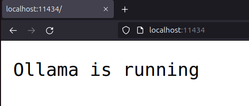
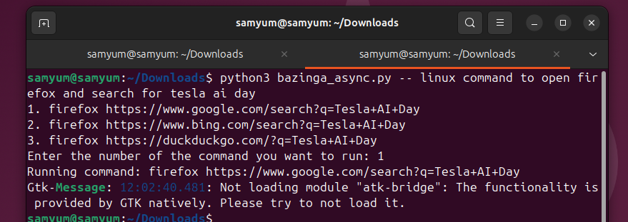

# Bazinga: Chat Command Runner with Local LLaMA3

## Overview

This Python script uses the `ollama` library to interact with the LLaMA3 model and execute Linux commands suggested by the model. The LLaMA3 model, with 8 billion parameters, generates responses that might include executable commands enclosed in triple backticks. The script captures these commands, presents them to the user, and allows the user to execute a selected command directly in the terminal.

## Installation

### Prerequisites

- Python 3.7 or newer
- `pip` (Python package installer)

### Install `ollama`

To install the `ollama` , run:

```bash
curl -fsSL https://ollama.com/install.sh | sh
```
Test if ollama server is running



Pull and test llama3 model

```bash
ollama pull llama3
ollama run llama3
```
## Usage

1. **Run the Script**

   Execute the script from the command line, providing a question as an argument:

   ```bash
   python3 bazinga_async.py -- "Your question here"
   ```
2. **Interact with the Script**

   - The script sends the provided question to the LLaMA3 model and streams the response.
   - It extracts Linux commands wrapped in triple backticks from the response.
   - The script lists these commands with numbering and prompts the user to select one.

3. **Choose and Execute Command**

   - Enter the number corresponding to the command you wish to execute.
   - The script runs the selected command in the terminal using `subprocess.run()`.

## Example

```bash
python3 bazinga_async.py -- "How can I list all files in a directory?"
```

Output:
```
1. ls -al
2. find . -type f

Enter the number of the command you want to run:
```

## Notes

- Ensure that the commands generated by the model are safe to execute in your environment.
- The script only supports running commands in a Unix-like terminal.
- Error handling is included to manage invalid choices.

## Troubleshooting

- If you encounter issues with the `ollama` library, verify your installation and ensure you have the latest version.
- For errors related to command execution, check the command syntax and permissions.

## Few example screenshots
### Running the code


### Ouput: Linux run the command chose

